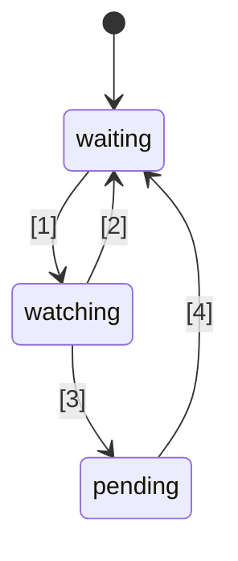

# URL Translation

- Source URL: https://github.com/tc39/proposal-signals
- Target language: Simplified Chinese
- Segment count: 18

### SEGMENT-001

# 源内容

- 网址: https://github.com/tc39/proposal-signals
- 范围：文章
- 标题：GitHub - tc39/proposal-signals：为 JavaScript 添加信号的提案 · GitHub

# 🚦 JavaScript Signals 标准提案🚦

/tc39/proposal-signals/blob/main/Signals.svg

第一阶段（ 说明（https://tc39.es/process-document/） ）

TC39 提案负责人：Daniel Ehrenberg, Yehuda Katz, Jatin Ramanathan, Shay Lewis, Kristen Hewell Garrett, Dominic Gannaway, Preston Sego, Milo M, Rob Eisenberg

原作者：Rob Eisenberg 和 Daniel Ehrenberg

本文档描述了 JavaScript 中信号的早期共同方向，类似于 Promises/A+ 在 TC39 于 ES2015 标准化 Promise 之前所做的工作。您可以使用 Polyfill（https://github.com/proposal-signals/signal-polyfill）自行尝试。

与 Promises/A+ 类似，这项工作侧重于统一 JavaScript 生态。如果这种统一成功，则可以在此基础上形成一个标准。多位框架作者正在此协作，共同构建一个可支撑其响应式核心的通用模型。当前草案基于以下框架作者/维护者的设计意见：Angular（https://angular.io/）、Bubble（https://bubble.io/）、Ember（https://emberjs.com/）、FAST（https://www.fast.design/）、MobX（https://mobx.js.org/）、Preact（https://preactjs.com/）、Qwik（https://qwik.dev/）、RxJS（https://rxjs.dev/）、Solid（https://www.solidjs.com/）、Starbeam（https://www.starbeamjs.com/）、Svelte（https://svelte.dev/）、Vue（https://vuejs.org/）、Wiz（https://blog.angular.io/angular-and-wiz-are-better-together-91e633d8cd5a）等……

与 Promises/A+ 不同的是，我们并非试图解决面向开发者的通用表层 API，而是致力于定义底层信号图的精确核心语义。本提案确实包含了一个完整的 API，但该 API 并非面向大多数应用开发者。相反，这里的信号 API 更适合作为框架在其之上构建的基础，通过通用的信号图和自动跟踪机制实现互操作性。

本提案的计划是在进入第一阶段之前进行大量的早期原型设计，包括将其集成到多个框架中。我们只会在信号确实适用于多个框架的实际使用，并且相较于框架自有的信号能带来实际好处时，才考虑将其标准化。我们希望大量的早期原型工作能为我们提供这些信息。有关更多详细信息，请参见下文“状态与开发计划”。

## 背景：为什么需要 Signals？

为了开发复杂的用户界面（UI），JavaScript 应用开发者需要以高效的方式存储、计算、失效、同步并将状态推送到应用的视图层。UI 通常不仅仅是管理简单的值，还经常涉及渲染依赖于其他值的复杂树或者本身也是计算得出的状态。Signals 的目标是为管理此类应用状态提供基础设施，让开发者能够专注于业务逻辑而非这些重复的细节。

信号状的构造在非 UI 场景中也被独立发现非常有用，特别是在构建系统中，可以避免不必要的重新构建。

信号用于响应式编程，以消除在应用中管理更新的需要。

摘自《什么是响应式编程？》（https://www.pzuraq.com/blog/what-is-reactivity）。

#### 示例 - 一个 VanillaJS 计数器

给定一个变量 `counter`，您想要在 DOM 中渲染该计数器是偶数还是奇数。每当计数器改变时，您希望用最新的奇偶状态更新 DOM。在原生 JavaScript 中，您可能会写出类似以下的代码：

```
let

counter

=

0
;

const

setCounter

=

(
value
)

=>

{

counter

=

value
;

render
(
)
;

}
;

const

isEven

=

(
)

=>

(
counter

&

1
)

==

0
;

const

parity

=

(
)

=>

isEven
(
)
 ?
"even"
 :
"odd"
;

const

render

=

(
)

=>

element
.
innerText

=

parity
(
)
;

### SEGMENT-002

```javascript
// Simulate external updates to counter...
setInterval(() => setCounter(counter + 1), 1000);
```

注意

这里使用全局变量仅用于演示。正确的状态管理有多种解决方案，本提案中的示例旨在尽可能精简。本提案不鼓励使用全局变量。

这存在许多问题……

-   计数器的初始设置繁琐且包含大量样板代码。
-   计数器状态与渲染系统紧密耦合。
-   如果计数器改变但奇偶性不变（例如计数器从 2 变为 4），我们会进行不必要的奇偶性计算和不必要的渲染。
-   如果 UI 的其他部分只想在计数器更新时渲染，该怎么办？
-   如果 UI 的其他部分仅依赖于 `isEven` 或 `parity`，该怎么办？

即使在这个相对简单的场景中，也会迅速出现一系列问题。我们可以尝试通过为 `counter` 引入发布/订阅模式来解决这些问题。这样，计数器的其他消费者可以订阅，以便在状态变化时添加自己的响应。

然而，我们仍然面临以下问题：

-   仅依赖于 `parity` 的渲染函数，反而必须“知道”自己实际上需要订阅 `counter`。
-   无法仅基于 `isEven` 或 `parity` 来更新 UI，而不直接与 `counter` 交互。
-   我们增加了样板代码。每当你使用某个东西时，不再仅仅是调用函数或读取变量，而是要订阅并在那里进行更新。尤其是管理取消订阅也变得相当复杂。

现在，我们可以通过不仅为 `counter`，也为 `isEven` 和 `parity` 添加发布/订阅来解决几个问题。然后我们需要将 `isEven` 订阅到 `counter`，`parity` 订阅到 `isEven`，渲染函数订阅到 `parity`。不幸的是，不仅我们的样板代码急剧膨胀，而且陷入了大量订阅的记录管理，如果未能以正确的方式妥善清理所有内容，就可能导致内存泄漏灾难。因此，我们解决了一些问题，却创造了全新类别的问题和大量代码。更糟糕的是，我们必须对系统中的每一个状态片段都重复这整个过程。

### 引入信号

UI 中模型与视图的数据绑定抽象，长期以来一直是跨多种编程语言的 UI 框架的核心，尽管 JS 或 Web 平台本身并没有内置任何此类机制。在 JS 框架和库中，对于表示这种绑定的不同方式进行了大量实验，经验表明单向数据流与一种表示状态单元或派生计算结果的一等数据类型相结合的力量，这种数据类型现在常被称为“信号”。这种一等响应式值方法似乎首次在开源 JavaScript Web 框架中流行起来，是 2010 年的 Knockout（https://knockoutjs.com/）（https://blog.stevensanderson.com/2010/07/05/introducing-knockout-a-ui-library-for-javascript/）。此后几年，出现了许多变体和实现。在过去的三四年里，Signal 原语及相关方法获得了进一步发展，几乎每个现代 JavaScript 库或框架都有类似的东西，只是名称不同。

为了理解 Signal，让我们看看上面的示例，使用下文进一步阐述的 Signal API 重新构想。

#### 示例 – 信号计数器

```typescript
const counter = new Signal.State(0);
const isEven = new Signal.Computed(() => (counter.get() & 1) == 0);
const parity = new Signal.Computed(() => isEven.get() ? "even" : "odd");

// A library or framework defines effects based on other Signal primitives
declare function effect(cb: () => void): () => void;

effect(() => element.innerText = parity.get());
```

### SEGMENT-003

// 模拟外部对 counter 的更新…

setInterval
(
(
)

=>

counter
.
set
(
counter
.
get
(
)

+

1
)
,

1000
)
;
```

我们立刻能看出几点：

- 我们消除了之前示例中围绕 counter 变量的嘈杂样板代码。
- 有一个统一的 API 来处理值、计算和副作用。
- 在 counter 和 render 之间不再存在循环引用或颠倒的依赖关系。
- 无需手动订阅，也不必进行任何记录管理。
- 提供了控制副作用触发时机/调度的手段。

不过，Signals 所赋予的远不止这些表面的 API：

- 自动依赖跟踪 —— 一个计算型 Signal 会自动发现它所依赖的所有其他 Signal，不管这些 Signal 是简单值还是其他计算。
- 惰性求值 —— 计算在其声明时不会立即执行，在其依赖发生变化时也不会立刻重新计算。只有当其值被显式请求时，它才会被计算。
- 记忆化 —— 计算型 Signal 会缓存上次的值，这样如果依赖没有变化，无论访问多少次，都无需重复计算。

## 标准化 Signals 的动机

#### 互操作性

每个 Signal 实现都有自己的自动跟踪机制，以便在计算型 Signal 求值时记录遇到的源。这使得在不同的框架之间共享模型、组件和库变得困难 —— 它们往往会与各自的视图引擎产生一种虚假的耦合（因为 Signals 通常是作为 JS 框架的一部分实现的）。

本提案的一个目标是彻底解耦响应式模型与渲染视图，使开发者能够在迁移到新的渲染技术时无需重写非 UI 代码，或者开发在 JS 中可重用的响应式模型，以便在不同上下文中部署。不幸的是，由于版本化和重复加载的问题，通过 JS 级别的库实现强有力的共享已被证明不够现实——内置特性则可提供更强的共享保障。

#### 性能/内存使用

对于常用库被内置的情况，减少传输的代码量总会带来一点性能提升，但 Signal 的库实现通常很小，因此我们预计这种效果不会很显著。

我们推测，采用 C++ 原生实现的 Signal 相关数据结构和算法，比起用 JS 实现的版本，在常数因子上可能会略微高效一些。然而，并不预期会有算法级别的改变，与 polyfill 中的实现相比不会有根本不同；引擎并非魔法，响应式算法本身将是明确定义且无歧义的。

提案推动小组计划开发多种 Signal 实现，并利用它们来探索这些性能优化可能。

#### 开发者工具

对于现有的 JS 语言 Signal 库，通常难以追踪以下事项：

- 跨多个计算型 Signal 的调用栈，以展示错误的因果链
- Signal 之间的引用图，当一个 Signal 依赖另一个时——对于调试内存使用至关重要

内置的 Signal 让 JS 运行时和开发者工具有可能提供更好的 Signal 检查支持，尤其适用于调试或性能分析，无论是直接内置在浏览器中，还是通过共享的扩展来实现。像元素检查器、性能快照和内存分析器等现有工具可以更新，以便在信息呈现时特别标示出 Signal。

#### 次要优势

##### 标准库的优势

### SEGMENT-004

总的来说，JavaScript 的标准库一直相当精简，但 TC39 的一个趋势是让 JS 更像一门“开箱即用”的语言，提供一套高质量的内置功能。例如，Temporal 正在取代 moment.js，而 Array.prototype.flat 和 Object.groupBy 等一些小特性也在替代 lodash 的许多用例。这样做的好处包括减小包体积、提升稳定性和质量、加入新项目时学习成本更低，以及在 JS 开发者之间建立通用的交流词汇。

##### HTML/DOM 集成（一种未来的可能性）

W3C 和浏览器实现者当前的工作正致力于将原生模板化引入 HTML（ DOM Parts (https://github.com/WICG/webcomponents/pull/1023) 和 Template Instantiation (https://github.com/WICG/webcomponents/blob/gh-pages/proposals/Template-Instantiation.md) ）。此外，W3C Web Components CG 正在探索扩展 Web Components 以提供完全声明式的 HTML API 的可能性。为了实现这两个目标，HTML 最终需要一种响应式原语。同时，通过集成 Signals 对 DOM 的许多人体工程学改进也可以想象，社区已经提出过相关需求。

##### 生态系统信息交流（不是交付的理由）

有时，即使浏览器没有发生变化，标准化工作在“社区”层面也会有所帮助。Signals 的努力将许多不同的框架作者聚集在一起，就响应式的本质、算法和互操作性进行深入讨论。这已经起到了积极作用，但并不能证明 Signals 应当被纳入 JS 引擎和浏览器；只有当其带来的好处远超这种生态系统信息交流时，才应该将 Signals 添加到 JavaScript 标准中。

## Signals 的设计目标

事实证明，现有的 Signal 库在核心层面彼此并没有太大差异。本提案旨在立足它们的成功之处，实现其中许多库所共有的重要品质。

### 核心特性

### SEGMENT-005

- 一种表示状态的 Signal 类型，即可写 Signal。这是一个其他组件可以读取的值。
- 一种计算/记忆/派生 Signal 类型，它依赖于其他 Signal，并进行惰性计算和缓存。
  - 计算是惰性的，意味着默认情况下当某个依赖项发生变化时，计算 Signal 不会重新计算，而只有在有组件实际读取它们时才会执行。
  - 计算是“无 glitch (https://en.wikipedia.org/wiki/Reactive_programming#Glitches) ”的，意味着不会执行任何不必要的计算。这意味着，当应用读取一个计算 Signal 时，会对图中可能变脏的部分进行拓扑排序并运行，以消除任何重复计算。
  - 计算会被缓存，意味着如果在上次依赖项变化之后，没有任何依赖项再发生变化，那么当再次访问该计算 Signal 时，不会重新计算。
  - 可以为计算 Signal 以及状态 Signal 提供自定义比较函数，以便在依赖它们的其他计算 Signal 需要更新时发出通知。
- 对计算 Signal 的某个依赖项（或嵌套依赖项）变为“脏”并发生变化的情况做出反应，这意味着该 Signal 的值可能已过时。
  - 这种反应旨在将更重要的工作安排到稍后执行。
  - Effect 是基于这些反应以及框架级的调度来实现的。
  - 计算 Signal 需要能够对自身是否被注册为这些反应的（嵌套）依赖项做出反应。
- 允许 JS 框架自行调度。没有内置的、类似 Promise 的强制调度机制。
  - 需要同步反应，以便能够根据框架逻辑来调度后续工作。
  - 写入是同步的，并立即生效（需要批量写入的框架可以在此基础上实现）。
  - 可以将检查 Effect 是否可能“变脏”与实际运行 Effect 分离开来（从而实现两阶段的 Effect 调度器）。
- 能够在不触发依赖记录的情况下读取 Signal（ untrack ）
- 允许组合使用不同代码库中的 Signal/响应式系统，例如：
  - 在跟踪/响应式本身方面，同时使用多个框架（除了一些遗漏，见下文）
  - 与框架无关的响应式数据结构（例如，递归响应式存储代理、响应式 Map、Set 和 Array 等）

### 健全性

- 不鼓励/禁止天真地滥用同步反应。
  - 健全性风险：如果使用不当，可能会暴露“ glitches (https://en.wikipedia.org/wiki/Reactive_programming#Glitches) ”：如果在设置 Signal 时立即进行渲染，可能会向最终用户暴露不完整的应用状态。因此，此功能应仅用于在应用逻辑完成后，智能地安排后续工作。
  - 解决方案：禁止在同步反应回调中读取和写入任何 Signal
- 不鼓励使用 untrack 并指出其不健全的本质
  - 健全性风险：允许创建其值依赖于其他 Signal，但不会在那些 Signal 变化时更新的计算 Signal。仅当非跟踪访问不会改变计算结果时，才应使用它。
  - 解决方案：该 API 在名称中标记为“unsafe”。
- 注意：尽管存在健全性风险，但本提案确实允许在计算 Signal 和 Effect Signal 中读取和写入 Signal，且不限制在读取之后进行的写入。做出这一决定是为了保持与框架集成时的灵活性和兼容性。

### 对外 API

### SEGMENT-006

- 必须为多种框架实现其信号/响应式机制提供坚实的基础。
  - 应该成为递归存储代理、基于装饰器的类字段响应式，以及 .value 和 [state, setState] 风格 API 的良好基础。
  - 其语义能够表达不同框架所支持的有效模式。例如，这些信号应该能够作为即时反映写入或批量延迟应用写入的基础。
- 如果该 API 能直接供 JavaScript 开发者使用，那就更好了。
  - 如果某个特性与生态系统中的概念相匹配，使用通用词汇是好的。
    - 但是，务必不要完全遮蔽完全相同的名称！
  - “JS 开发者的可用性”与“为框架提供所有钩子”之间存在矛盾。
    - 想法：提供所有钩子，但如果可能，在误用时抛出错误。
    - 想法：将微妙的 API 放在微妙的命名空间中，类似于 crypto.subtle (https://developer.mozilla.org/en-US/docs/Web/API/Crypto/subtle)，以区分用于实现框架或构建开发工具等更高级用法所需的 API，与更日常的应用开发用法（例如为框架实例化信号）。
- 具有良好性能，可实现且可用——表层 API 不会造成过多开销
  - 支持子类化，以便框架可以添加自己的方法和字段，包括私有字段。这对于避免框架层面额外的内存分配非常重要。参见下文的“内存管理”。

### 内存管理

- 如果可能：如果没有任何活动引用指向一个计算信号以备将来读取，即使它链接到一个保持活跃的更广泛图中（例如通过读取一个保持活跃的状态），该计算信号应该能被垃圾回收。
  - 注意，如今大多数框架要求显式处理计算信号，如果它们有对另一个保持活跃的信号图的引用或来自该图的引用。
  - 当其生命周期与 UI 组件的生命周期相关联，并且副作用无论如何都需要处理时，这最终并不是那么糟糕。
  - 如果以这些语义执行成本太高，那么我们应该在下面的 API 中添加计算信号的显式处置（或“取消链接”），而当前 API 缺少此项。
- 一个单独相关的目标：尽量减少分配数量，例如：
  - 创建可写信号（避免两个独立的闭包 + 数组）
  - 实现副作用（避免为每个 reaction 创建一个闭包）
  - 在观察信号变化的 API 中，避免创建额外的临时数据结构
  - 解决方案：基于类的 API，可重用子类中定义的方法和字段

### API 草案

下面是一个 Signal API 的初步想法。请注意，这只是一个早期草案，我们预计会随时间变化。先来看看完整的 .d.ts 以了解整体形态，然后我们再讨论细节含义。

```
interface
Signal
<
T
>
{

// Get the value of the signal

get
(
)
:
T
;

}

namespace

Signal

{

// A read-write Signal

class

State
<
T
>

implements

Signal
<
T
>
{

// Create a state Signal starting with the value t

constructor
(
t
:
T
,

options
?:
SignalOptions
<
T
>
)
;

// Get the value of the signal

get
(
)
:
T
;

// Set the state Signal value to t

set
(
t
:
T
)
:
void
;

}

// A Signal which is a formula based on other Signals

class

Computed
<
T

=

unknown
>

implements

Signal
<
T
>
{

// Create a Signal which evaluates to the value returned by the callback.

// Callback is called with this signal as the this value.

constructor
(
cb
:
(
this
:
Computed
<
T
>
)

=>

T
,

options
?:
SignalOptions
<
T
>
)
;

// Get the value of the signal

get
(
)
:
T
;

}

// This namespace includes "advanced" features that are better to

// leave for framework authors rather than application developers.

// Analogous to `crypto.subtle`

namespace

subtle

{

// ...

}

}
```

### SEGMENT-007

// 在所有追踪禁用的情况下运行回调

function

untrack
<
T
>
(
cb
:
(
)

=>

T
)
:
T
;

// 获取当前正在追踪信号读取的 computed 信号（如果有）

function

currentComputed
(
)
:
Computed

|

null
;

// 返回该信号在上次求值时引用的所有信号的有序列表。

// 对于 Watcher，列出它正在监视的信号集合。

function

introspectSources
(
s
:
Computed

|

Watcher
)
:
(
State

|

Computed
)
[
]
;

// 返回包含此信号的 Watcher，以及任何上次求值时读取了此信号的 Computed 信号

// （如果该 computed 信号被递归地监视）。

function

introspectSinks
(
s
:
State

|

Computed
)
:
(
Computed

|

Watcher
)
[
]
;

// 如果此信号是“活跃的”，即它被 Watcher 监视，

// 或者被一个（递归地）活跃的 Computed 信号读取，则为 true。

function

hasSinks
(
s
:
State

|

Computed
)
:
boolean
;

// 如果此元素是“响应式的”，即它依赖于其他某个信号，则为 true。

// 对于 hasSources 为 false 的 Computed，将始终返回相同的常量。

function

hasSources
(
s
:
Computed

|

Watcher
)
:
boolean
;

class

Watcher

{

// 当 Watcher 的某个（递归的）源被写入时，调用此回调，

// 前提是自上次 `watch` 调用以来尚未调用过。

// 在通知期间不得读取或写入任何信号。

constructor
(
notify
:
(
this
:
Watcher
)

=>

void
)
;

// 将这些信号添加到 Watcher 的集合中，并设置该 watcher 在下次集合中的任何信号

// （或其依赖项之一）发生变化时运行其 notify 回调。

// 可以不传参数调用，仅用于重置“已通知”状态，以便 notify 回调能再次被调用。

watch
(
...
s
:
Signal
[
]
)
:
void
;

// 从被监视集合中移除这些信号（例如，用于被销毁的 effect）

unwatch
(
...
s
:
Signal
[
]
)
:
void
;

// 返回 Watcher 集合中仍然被认为是脏的，或者是一个 computed 信号，

// 其源是脏的或待处理的，且尚未被重新求值的信号集合

getPending
(
)
:
Signal
[
]
;

}

// 用于观察被监视或不再被监视的钩子

var

watched
:
Symbol
;

var

unwatched
:
Symbol
;

}

interface

SignalOptions
<
T
>

{

// 新旧值之间的自定义比较函数。默认：Object.is。

// 信号作为 this 值传入以提供上下文。

equals
?:
(
this
:
Signal
<
T
>
,

t
:
T
,

t2
:
T
)

=>

boolean
;

// 当 isWatched 变为 true 时调用的回调（如果之前为 false）

[
Signal
.
subtle
.
watched
]
?:
(
this
:
Signal
<
T
>
)

=>

void
;

// 每当 isWatched 变为 false 时调用的回调（如果之前为 true）

[
Signal
.
subtle
.
unwatched
]
?:
(
this
:
Signal
<
T
>
)

=>

void
;

}

}
```

### 信号的工作原理

信号表示一个可能随时间变化的数据单元。信号可以是“状态”（手动设置的值）或“计算值”（基于其他信号的公式）。

计算信号的工作原理是自动追踪在其求值期间读取了哪些其他信号。当读取一个计算信号时，它会检查其先前记录的依赖项中是否有任何发生了变化，如果有则重新求值。当多个计算信号嵌套时，所有追踪的归属都归于最内层的信号。

计算信号是惰性的，即基于拉取的：即使其某个依赖项较早发生了变化，它们也只有在被访问时才会重新求值。

传入计算信号的回调通常应该是“纯”的，即它是所访问的其他信号的确定性、无副作用的函数。同时，回调被调用的时机是确定性的，允许谨慎地使用副作用。

### SEGMENT-008

信号明显具备缓存/记忆化特性：状态信号和计算信号都会记住其当前值，只有当引用的源信号实际发生变化时，才会触发依赖它的计算信号重新求值。甚至无需重复比较新旧值——当源信号被重置/重新求值时只进行一次比较，信号机制会跟踪哪些引用了该信号的项尚未根据新值更新。在内部，这通常通过“图着色”来表示，如（Milo 的博客文章）中所述。

计算信号会动态追踪其依赖——每运行一次，它们最终可能依赖不同的东西，而这个精确的依赖集会实时保持在信号图中。这意味着，如果某个依赖只在一个分支上需要，而上一次计算走的是另一个分支，那么即使那个暂时未使用的值发生变化，拉取时也不会导致该计算信号重新计算。

与 JavaScript Promise 不同，信号中的所有操作都是同步的：

- 将信号设置为新值是同步的，之后读取任何依赖它的计算信号都会立即反映这个变化。这种变更没有内置的批处理。
- 读取计算信号是同步的——它们的值始终可用。
- 如下所述，观察者中的通知回调在触发它的 .set() 调用期间同步运行（但在图着色完成后）。

与 Promise 类似，信号也可以表示错误状态：如果计算信号的回调抛出异常，该错误会像其他值一样被缓存，并在每次读取该信号时重新抛出。

### 理解 Signal 类

Signal 实例代表读取动态变化值的能力，其更新会随时间被追踪。它同时也隐式地包含了订阅信号的能力，这种订阅通过其他计算信号中的追踪式访问隐式完成。

此处的 API 设计力求与大部分信号库在命名上的粗略生态共识保持一致，如使用 “signal”、“computed” 和 “state” 等名称。但是，访问计算信号和状态信号是通过 .get() 方法，这与所有流行的信号 API 不一致，后者要么使用 .value 风格的访问器，要么使用 signal() 调用语法。

该 API 的目标是减少分配次数，使信号既适合嵌入 JavaScript 框架，又能达到与现有框架定制化信号相同甚至更好的性能。这意味着：

- 状态信号是单个可写对象，可通过同一引用进行访问和设置。（相关影响请参见下文“能力分离”部分。）
- 状态信号和计算信号都被设计为可子类化，以便框架能通过公有和私有类字段（以及使用这些状态的方法）添加额外属性。
- 各种回调（例如 equals、计算回调）在调用时会将相关信号作为 this 上下文，因此无需为每个信号创建新的闭包。上下文可以保存在信号自身的额外属性中。

此 API 强制要求的一些错误条件：

- 递归读取计算信号会报错。
- 观察者的通知回调中不能读取或写入任何信号。
- 如果计算信号的回调抛出异常，那么后续对该信号的访问会重新抛出这个缓存的错误，直到某个依赖发生变化并导致重新计算。

不强制要求的条件包括：

- 计算信号可以在其回调中同步写入其他信号。
- 由观察者通知回调排入队列的工作可以读取或写入信号，因此有可能用信号的方式重现经典的 React 反模式（https://react.dev/learn/you-might-not-need-an-effect）！

### 实现副作用

### SEGMENT-009

前面定义的 Watcher 接口为实现典型的用于副作用（effects）的 JavaScript API 提供了基础：这些回调函数在其他信号发生变化时重新运行，纯粹是为了它们的副作用。上面在初始示例中使用的 effect 函数可以这样定义：

```
// This function would usually live in a library/framework, not application code

// NOTE: This scheduling logic is too basic to be useful. Do not copy/paste.

let

pending

=

false
;

let

w

=

new

Signal
.
subtle
.
Watcher
(
(
)

=>

{

if

(
!
pending
)

{

pending

=

true
;

queueMicrotask
(
(
)

=>

{

pending

=

false
;

for

(
let

s

of

w
.
getPending
(
)
)

s
.
get
(
)
;

w
.
watch
(
)
;

}
)
;

}

}
)
;

// An effect effect Signal which evaluates to cb, which schedules a read of

// itself on the microtask queue whenever one of its dependencies might change

export

function

effect
(
cb
)

{

let

destructor
;

let

c

=

new

Signal
.
Computed
(
(
)

=>

{

destructor
?.
(
)
;

destructor

=

cb
(
)
;

}
)
;

w
.
watch
(
c
)
;

c
.
get
(
)
;

return

(
)

=>

{

destructor
?.
(
)
;

w
.
unwatch
(
c
)

}
;

}
```

Signal API 不包含任何像 effect 这样的内置函数。这是因为 effect 的调度十分微妙，往往与框架的渲染周期以及 JS 无法接触到的其他高级框架特定状态或策略相关联。

下面梳理一下这里用到的各种操作：传递给 Watcher 构造函数的 notify 回调是一个函数，当 Signal 从“干净”（clean）状态（此时已知缓存已初始化且有效）转变为“已检查”（checked）或“脏”（dirty）状态（此时缓存可能有效也可能无效，因为其递归依赖的至少一个状态已经发生了变化）时，该函数会被调用。

最终，对某个状态 Signal 调用 .set() 会触发 notify 调用。这一调用是同步的：它在 .set() 返回之前发生。但不必担心此回调会观察到处于半处理状态的 Signal 图，因为在 notify 回调期间，即使是在 untrack 调用中，也无法读取或写入任何 Signal。因为 notify 是在 .set() 期间被调用的，它中断了另一可能尚未完成的逻辑线程。若要从 notify 中读取或写入 Signal，需要安排稍后执行的工作，例如将 Signal 记录到一个列表中稍后访问，或像上面那样使用 queueMicrotask。

请注意，完全可以在不使用 Signal.subtle.Watcher 的情况下高效地使用 Signals，例如像 Glimmer 那样安排对计算 Signal 的轮询。然而，许多框架发现，让这些调度逻辑同步运行常常非常有用，因此 Signals API 包含了它。

计算 Signals 和状态 Signals 都像其他 JS 值一样被垃圾回收。但 Watcher 有一套特殊的保持存活机制：任何被 Watcher 监视的 Signal，只要其底层的某些状态可达，就会被保持存活，因为这些状态可能触发未来的 notify 调用（进而触发未来的 .get()）。因此，请记得调用 Watcher.prototype.unwatch 来清理 effects。

### 一个不可靠的逃生舱

Signal.subtle.untrack 是一个逃生舱，允许读取 Signal 而无需跟踪这些读取。这一能力是不安全的，因为它允许创建值依赖于其他 Signal 的计算 Signal，但当那些 Signal 变化时该计算 Signal 并不会更新。仅应在未跟踪的访问不会改变计算结果的情况下使用它。

### 暂时省略

### SEGMENT-010

这些特性可能会在以后添加，但它们不包含在当前的草案中。省略它们的原因在于各框架在设计空间上缺乏既定的共识，以及已证明能够通过本文档所描述的信号概念之上的机制来弥补它们的缺失。然而，遗憾的是，这种省略限制了框架之间互操作性的潜力。随着本文档所描述的信号原型的产生，我们将重新审视这些省略是否恰当。

- 异步：在此模型中，信号始终可同步评估。然而，通常需要某些异步流程来导致信号被设置，并了解信号何时仍处于“加载”状态。一种简单的建模加载状态的方法是使用异常，而计算信号的异常缓存行为与这种技术组合得还算合理。改进的技术在 Issue #30 (https://github.com/proposal-signals/proposal-signals/issues/30) 中讨论。
- 事务：在视图之间的过渡中，通常需要同时维护“从”和“到”状态的实时视图。“到”状态在后台渲染，直到准备好切换（提交事务），而“从”状态保持可交互。同时维护两种状态需要“分支”信号图的状态，甚至可能需要支持多个待处理的过渡。讨论见 Issue #73 (https://github.com/proposal-signals/proposal-signals/issues/73) 。

一些可能的便捷方法 (https://github.com/proposal-signals/proposal-signals/issues/32) 也被省略了。

## 状态与开发计划

本提案已列入 2024 年 4 月 TC39 议程，处于 Stage 1。目前可将其视为 “Stage 0”。

本提案有一个 polyfill (https://github.com/proposal-signals/signal-polyfill) 可用，并附带了一些基本测试。一些框架作者已开始尝试替换此信号实现，但这种使用尚处于早期阶段。

信号提案的合作者们希望以特别保守的方式推进此提案，以免陷入发布后却后悔并实际未使用的困境。我们的计划是完成以下额外任务（TC39 流程不要求这些），以确保此提案走在正轨上：

在提议进入 Stage 2 之前，我们计划：

- 开发多个生产级的 polyfill 实现，它们健壮、经过充分测试（例如，通过来自各种框架的测试以及 test262 风格的测试），并且在性能上具有竞争力（通过全面的信号/框架基准测试集验证）。
- 将提出的 Signal API 集成到大量我们认为具有代表性的 JS 框架中，并让一些大型应用在此基础上运行。测试它在这些上下文中是否高效且正确地工作。
- 对 API 可能的扩展空间有扎实的理解，并得出哪些（如果有）应添加到此提案中的结论。

## 信号算法

本节描述了每个向 JavaScript 暴露的 API，用它们实现的算法来表达。这可以被视为一份原型规范，在此早期阶段纳入其中是为了确定一组可能的语义，同时对修改持非常开放的态度。

算法的一些方面：

### SEGMENT-011

- 在计算信号内部，读取信号的顺序很重要，并且可通过某些回调（即 Watcher 被调用、equals、new Signal.Computed 的第一个参数以及 watched / unwatched 回调）的执行顺序观察到。这意味着计算信号的源必须按顺序存储。
- 这四个回调都可能抛出异常，这些异常会以可预测的方式传播到调用方 JS 代码。异常不会中止该算法的执行或使图处于半处理状态。对于在 Watcher 的 notify 回调中抛出的错误，该异常会发送到触发它的 .set() 调用，如果抛出多个异常则使用 AggregateError。其他异常（包括 watched / unwatched ？）则存储在 Signal 的值中，在读取时重新抛出，并且这样的重新抛出 Signal 可以像任何具有正常值的信号一样被标记为 ~clean~。
- 对于未被“监视”（即未被任何 Watcher 观察）的计算信号，会小心避免循环依赖，以便它们能够独立于信号图的其他部分被垃圾回收。在内部，这可以通过始终收集的代数编号系统来实现；注意，优化实现也可能包含局部的每节点代数编号，或在被监视的信号上避免跟踪某些编号。

### 隐藏的全局状态

Signal 算法需要引用某些全局状态。该状态对整个线程或“代理”是全局的。

- computing：由于 .get 或 .run 调用而当前正在被重新求值的最内层计算或效果 Signal，或为 null。初始为 null。
- frozen：布尔值，表示当前是否有正在执行的回调要求不能修改图。初始为 false。
- generation：一个递增整数，从 0 开始，用于跟踪值的时效性，同时避免循环依赖。

### Signal 命名空间

Signal 是一个普通对象，用作与 Signal 相关的类和函数的命名空间。

Signal.subtle 是一个类似的内部命名空间对象。

### Signal.State 类

#### Signal.State 内部槽

- value：状态信号的当前值
- equals：更改值时使用的比较函数
- watched：当信号被效果观察时要调用的回调
- unwatched：当信号不再被效果观察时要调用的回调
- sinks：依赖此信号的被监视信号的集合

#### 构造函数：Signal.State(initialValue, options)

- 将此 Signal 的 value 设置为 initialValue。
- 将此 Signal 的 equals 设置为 options?.equals
- 将此 Signal 的 watched 设置为 options?.[Signal.subtle.watched]
- 将此 Signal 的 unwatched 设置为 options?.[Signal.subtle.unwatched]
- 将此 Signal 的 sinks 设置为空集合

#### 方法：Signal.State.prototype.get()

- 如果 frozen 为 true，则抛出异常。
- 如果 computing 不为 undefined，则将此 Signal 添加到 computing 的 sources 集合中。
- 注意：在被 Watcher 监视之前，我们不会将 computing 添加到此 Signal 的 sinks 集合中。
- 返回此 Signal 的 value。

#### 方法：Signal.State.prototype.set(newValue)

### SEGMENT-012

- 如果当前执行上下文被冻结，则抛出异常。
- 使用此 Signal 和第一个参数作为值，运行“设置 Signal 值”算法。
- 如果该算法返回 ~clean~，则返回 undefined。
- 将此 Signal 的所有 sinks 的状态设置为：（如果是 Computed Signal）如果它们之前是 clean，则设为 ~dirty~；（如果是 Watcher）如果之前是 ~watching~，则设为 ~pending~。
- 将所有 sinks 的 Computed Signal 依赖项的状态（递归地）设置为：如果它们之前是 ~clean~，则设为 ~checked~（即保留 dirty 标记），对于 Watcher，如果之前是 ~watching~，则设为 ~pending~。
- 对于在该递归搜索中遇到的每个之前为 ~watching~ 的 Watcher，然后按深度优先顺序，
  - 将 frozen 设置为 true。
  - 调用它们的 notify 回调（保存抛出的任何异常，但忽略 notify 的返回值）。
  - 将 frozen 恢复为 false。
  - 将 Watcher 的状态设置为 ~waiting~。
- 如果在 notify 回调中抛出了任何异常，则在所有 notify 回调运行完毕后将其传播给调用者。如果有多个异常，则将它们打包到一个 AggregateError 中并抛出该错误。
- 返回 undefined。

### Signal.Computed 类

#### Signal.Computed 状态机

Computed Signal 的状态可以是以下之一：

- ~clean~：Signal 的值存在且已知不是过时的。
- ~checked~：此 Signal 的一个（间接）源已更改；此 Signal 有一个值，但可能过时。是否过时只有在所有直接源都被评估后才能知道。
- ~computing~：此 Signal 的回调当前正在作为 .get() 调用的副作用执行。
- ~dirty~：此 Signal 要么有一个已知过时的值，要么从未被评估过。

转换图如下：

```
stateDiagram-v2
    [*] --> dirty
    dirty --> computing: [4]
    computing --> clean: [5]
    clean --> dirty: [2]
    clean --> checked: [3]
    checked --> clean: [6]
    checked --> dirty: [1]
```

Loading

转换如下：

编号 | 从 | 到 | 条件 | 算法
1 | ~checked~ | ~dirty~ | 此 signal 的一个直接源（它是一个 computed signal）已被评估，且其值已更改。 | 算法：recalculate dirty computed Signal
2 | ~clean~ | ~dirty~ | 此 signal 的一个直接源（它是一个 State）已被设置，并且其值不等于之前的值。 | 方法：Signal.State.prototype.set(newValue)
3 | ~clean~ | ~checked~ | 此 signal 的一个递归（非直接）源（它是一个 State）已被设置，并且其值不等于之前的值。 | 方法：Signal.State.prototype.set(newValue)
4 | ~dirty~ | ~computing~ | 我们即将执行回调。 | 算法：recalculate dirty computed Signal
5 | ~computing~ | ~clean~ | 回调已完成评估，并返回了一个值或抛出了一个异常。 | 算法：recalculate dirty computed Signal
6 | ~checked~ | ~clean~ | 此 signal 的所有直接源都已被评估，并发现均未更改，因此我们现在知道它并不过时。 | 算法：recalculate dirty computed Signal

#### Signal.Computed 内部槽

- value：Signal 的先前缓存值，对于从未读取的 computed Signal 则为 ~uninitialized~。该值可能是一个异常，在读取该值时会被重新抛出。对于 effect signal，始终为 undefined。
- state：可能为 ~clean~、~checked~、~computing~ 或 ~dirty~。
- sources：此 Signal 所依赖的一组有序 Signals。
- sinks：依赖此 Signal 的一组有序 Signals。
- equals：选项中提供的 equals 方法。
- callback：用于获取 computed Signal 值的回调。设置为传递给构造函数的第一个参数。

#### Signal.Computed 构造函数

该构造函数设置

### SEGMENT-013

- 将回调设置为它的第一个参数
- equals 基于选项，如果选项缺失，则默认使用 Object.is
- 状态设为 ~dirty~
- 值设为 ~uninitialized~

使用 AsyncContext（https://github.com/tc39/proposal-async-context）时，传递给 new Signal.Computed 的回调会捕获构造函数调用时的快照，并在其执行期间恢复此快照。

#### 方法：Signal.Computed.prototype.get

- 如果当前执行上下文被冻结，或如果此 Signal 的状态为 ~computing~，或如果此 signal 是一个 Watcher 且正在计算某个 Computed Signal，则抛出异常。
- 如果 computing 不为 null，将此 Signal 添加到 computing 的 sources 集合中。
- 注意：我们不会将 computing 添加到此 Signal 的 sinks 集合中，除非/直到它被某个 Watcher 观察。
- 如果此 Signal 的状态为 ~dirty~ 或 ~checked~：重复以下步骤直到此 Signal 变为 ~clean~：
  - 通过 sources 向上递归，找到最深、最左（即最早被观察到的）递归源，它是一个被标记为 ~dirty~ 的 Computed Signal（当遇到一个 ~clean~ 的 Computed Signal 时截断搜索，并且将此 Computed Signal 作为最后搜索的对象包含在内）。
  - 对该 Signal 执行“重新计算脏的 Computed Signal”算法。
- 此时，此 Signal 的状态将变为 ~clean~，并且不会有任何递归源处于 ~dirty~ 或 ~checked~ 状态。返回该 Signal 的 value。如果该值为异常，则重新抛出该异常。

### Signal.subtle.Watcher 类

#### Signal.subtle.Watcher 状态机

Watcher 的状态可能是以下之一：

- ~waiting~：通知回调已被运行，或者 Watcher 是新的，但未主动观察任何信号。
- ~watching~：Watcher 正在主动观察信号，但尚未发生任何需要触发通知回调的更改。
- ~pending~：Watcher 的某个依赖项已更改，但通知回调尚未运行。

状态转换图如下：



Loading

转换规则：

编号 | 从 | 到 | 条件 | 算法
1 | ~waiting~ | ~watching~ | Watcher 的 watch 方法被调用。| 方法：Signal.subtle.Watcher.prototype.watch(...signals)
2 | ~watching~ | ~waiting~ | Watcher 的 unwatch 方法被调用，且最后一个被观察的信号被移除。| 方法：Signal.subtle.Watcher.prototype.unwatch(...signals)
3 | ~watching~ | ~pending~ | 某个被观察的信号可能已更改值。| 方法：Signal.State.prototype.set(newValue)
4 | ~pending~ | ~waiting~ | 通知回调已被运行。| 方法：Signal.State.prototype.set(newValue)

#### Signal.subtle.Watcher 内部槽

- state：可能为 ~watching~、~pending~ 或 ~waiting~
- signals：此 Watcher 正在观察的一组有序 Signal
- notifyCallback：当发生更改时调用的回调。设置为传递给构造函数的第一个参数。

#### 构造函数：new Signal.subtle.Watcher(callback)

- state 设为 ~waiting~。
- 将 signals 初始化为空集合。
- notifyCallback 设置为 callback 参数。

使用 AsyncContext（https://github.com/tc39/proposal-async-context）时，传递给 new Signal.subtle.Watcher 的回调不会捕获构造函数调用时的快照，这样写入操作周围的上下文信息就是可见的。

#### 方法：Signal.subtle.Watcher.prototype.watch(...signals)

### SEGMENT-014

- 如果 frozen 为 true，则抛出异常。
- 如果任何参数不是信号（signal），则抛出异常。
- 将所有参数追加到此对象的 `signals` 末尾。
- 对于每个新被监听的信号，按从左到右的顺序，
  - 将此观察者（watcher）作为接收器（sink）添加到该信号。
  - 如果这是第一个接收器，则向上递归到源，将该信号作为接收器添加。
  - 将 frozen 设置为 true。
  - 如果存在 watched 回调，则调用它。
  - 将 frozen 恢复为 false。
- 如果 Signal 的状态为 ~waiting~，则将其设置为 ~watching~。

#### Method: Signal.subtle.Watcher.prototype.unwatch(...signals)

- 如果 frozen 为 true，则抛出异常。
- 如果任何参数不是信号（signal），或者未被此观察者监听，则抛出异常。
- 对于参数中的每个信号，按从左到右的顺序，
  - 从该 Watcher 的 `signals` 集合中移除该信号。
  - 从该 Signal 的 sink 集合中移除此 Watcher。
  - 如果该 Signal 的 sink 集合变为空，则将该 Signal 作为接收器从其每个源中移除。
  - 将 frozen 设置为 true。
  - 如果存在 unwatched 回调，则调用它。
  - 将 frozen 恢复为 false。
- 如果观察者现在没有信号，且其状态为 ~watching~，则将其设置为 ~waiting~。

#### Method: Signal.subtle.Watcher.prototype.getPending()

- 返回一个数组，其中包含状态为 ~dirty~ 或 ~pending~ 的计算信号（Computed Signal）子集。

### Method: Signal.subtle.untrack(cb)

- 令 c 为执行上下文的当前 computing 状态。
- 将 computing 设置为 null。
- 调用 cb。
- 将 computing 恢复为 c（即使 cb 抛出了异常）。
- 返回 cb 的返回值（重新抛出任何异常）。

注意：untrack 无法让您脱离 frozen 状态，该状态会严格保持。

### Method: Signal.subtle.currentComputed()

- 返回当前的 computing 值。

### Common algorithms

##### Algorithm: recalculate dirty computed Signal

- 清空该 Signal 的 sources 集合，并将其从这些源（sources）的 sinks 集合中移除。
- 保存先前的 computing 值，并将 computing 设置为该 Signal。
- 将该 Signal 的状态设置为 ~computing~。
- 运行该计算信号的回调，使用该 Signal 作为 this 值。保存返回值，如果回调抛出异常，则存储该异常以供重新抛出。
- 恢复先前的 computing 值。
- 对回调的返回值应用“设置 Signal 值”算法。
- 将该 Signal 的状态设置为 ~clean~。
- 如果该算法返回 ~dirty~：将该 Signal 的所有接收器标记为 ~dirty~（此前，接收器可能处于 checked 和 dirty 的混合状态）。（或者，如果该 Signal 未被监听，则采用新的代编号以指示脏污，或类似机制。）
- 否则，该算法返回 ~clean~：在这种情况下，对于该 Signal 的每个 ~checked~ 接收器，如果该 Signal 的所有源现在都是 clean，则也将该 Signal 标记为 ~clean~。对进一步接收器递归应用此清理步骤，针对任何具有 checked 接收器的新 clean 信号。（或者，如果未被监听，以某种方式指示相同情况，以便清理可以惰性进行。）

##### Set Signal value algorithm

- 如果给该算法传递了一个值（而不是从“重新计算脏计算信号”算法中用于重新抛出的异常）：
  - 调用该 Signal 的 equals 函数，传入当前值、新值和该 Signal 作为参数。如果抛出异常，则将该异常保存为 Signal 的值（以便在读取时重新抛出），并像回调返回了 false 一样继续。
  - 如果该函数返回 true，则返回 ~clean~。
- 将该 Signal 的值设置为参数。
- 返回 ~dirty~

## FAQ

问：当 Signals 在 2022 年才开始成为热门新事物时，现在就对其进行标准化是否有点为时过早？我们不应该给它们更多的时间来进化和稳定吗？

### SEGMENT-015

A : Web框架中Signals的当前状态是十多年持续开发的结果。随着近年来投资的增加，几乎所有Web框架都正趋近于一个非常相似的Signals核心模型。本提案是众多当前Web框架领导者之间共同设计练习的成果，并且在没有该领域专家群体在各种情况下的验证之前，不会推进到标准化。

#### 如何使用Signals？

问 : 考虑到内置Signals与渲染和所有权的紧密集成，它们能否真正被框架所使用？

答 : 那些更特定于框架的部分往往落在效果、调度和所有权/释放等范畴，而本提案并未试图解决这些。我们针对标准轨道Signals原型开发的首要任务是验证它们能否以兼容且性能良好的方式“处于”现有框架的下层。

问 : Signal API旨在由应用开发者直接使用，还是由框架进行包装？

答 : 虽然这个API可以由应用开发者直接使用（至少不包括Signal.subtle命名空间的部分），但它并不刻意追求符合人体工程学。相反，库/框架作者的需求被优先考虑。大多数框架预计会用一些能体现其人体工程学倾向的方式来包装哪怕是基本的Signal.State和Signal.Computed API。在实践中，通常最好通过框架来使用Signals，框架会管理更棘手的特性（例如Watcher、untrack），以及管理所有权和释放（例如确定signals何时应被添加到watchers中以及何时应从中移除），并调度对DOM的渲染——本提案并未试图解决这些问题。

问 : 当一个小部件被销毁时，我是否需要拆除与该部件相关的Signals？相关的API是什么？

答 : 这里相关的拆除操作是Signal.subtle.Watcher.prototype.unwatch。只有被监视的Signals才需要清理（通过取消监视它们），而未被监视的Signals可以被自动垃圾回收。

问 : Signals能与VDOM配合工作，还是直接与底层HTML DOM配合？

答 : 都可以！Signals独立于渲染技术。现有的使用类Signal构造的JavaScript框架已经与VDOM（例如Preact）、原生DOM（例如Solid）以及两者的结合（例如Vue）集成。内置Signals也能做到同样的事。

问 : 在基于类的框架（如Angular和Lit）中使用Signals是否符合人体工程学？在基于编译器的框架（如Svelte）中呢？

答 : 类字段可以通过一个简单的访问器装饰器使其基于Signal，如Signal polyfill自述文件所示（https://github.com/proposal-signals/signal-polyfill#combining-signals-and-decorators） 。Signals与Svelte 5的Runes非常契合——编译器可以轻松地将runes转换为此处定义的Signal API，实际上这也是Svelte 5内部所做的（但使用的是它自己的Signals库）。

问 : Signals能与SSR配合吗？水合（Hydration）呢？可恢复性（Resumability）呢？

答 : 可以。Qwik有效地利用Signals实现了这两种特性，其他框架也有其他成熟的、具有不同权衡的Signals水合方法。我们认为可以通过一个State signal和一个Computed signal挂接在一起来模拟Qwik的可恢复Signals，并计划在代码中证明这一点。

问 : Signals能像React那样支持单向数据流吗？

答 : 是的，Signals是一种单向数据流机制。基于Signal的UI框架允许你将视图表达为模型的函数（其中模型包含Signals）。状态和计算信号构成的图在构造上就是无环的。当然，也可以在Signals中重现React的反模式（！），例如，相当于在useEffect内部调用setState的Signal做法是：使用Watcher来调度对State信号的写入操作。

### SEGMENT-016

Q : 信号与像 Redux 这样的状态管理系统有何关联？信号是否会鼓励非结构化的状态？

A : 信号可以为类似 store 的状态管理抽象提供高效基础。在多个框架中常见的一种模式是基于 Proxy 的对象，其内部使用信号来表示属性，例如 Vue reactive()（https://vuejs.org/api/reactivity-core.html#reactive）或 Solid stores（https://docs.solidjs.com/concepts/stores）。这些系统允许在特定应用程序的适当抽象级别灵活地对状态进行分组。

Q : 信号提供了 Proxy 目前无法处理的哪些功能？

A : Proxy 和信号是互补的，并且可以很好地协同工作。Proxy 允许您拦截浅层对象操作，而信号则协调依赖图（由单元格组成）。用信号支持 Proxy 是创建具有极佳人体工程学的嵌套响应式结构的绝佳方式。

在这个例子中，我们可以使用 proxy 来让信号拥有 getter 和 setter 属性，而不是使用 get 和 set 方法：

```
const

a

=

new

Signal
.
State
(
0
)
;

const

b

=

new

Proxy
(
a
,

{

get
(
target
,

property
,

receiver
)

{

if

(
property

===

'value'
)

{

return

target
.
get
(
)
:

}

}

set
(
target
,

property
,

value
,

receiver
)

{

if

(
property

===

'value'
)

{

target
.
set
(
value
)
!

}

}

}
)
;

// usage in a hypothetical reactive context:

<
template
>

{
b
.
value
}

<
button

onclick
=
{
(
)

=>

{

b
.
value
++
;

}
}
>
change
</
button
>

</
template
>
```

当使用针对细粒度响应性进行了优化的渲染器时，单击按钮将导致 b.value 单元格更新。

参见：

- 使用信号和 Proxy 创建的嵌套响应式结构示例：signal-utils（https://github.com/NullVoxPopuli/signal-utils/tree/main/src）
- 展示响应式数据与 proxy 之间关系的早期实现示例：tracked-built-ins（https://github.com/tracked-tools/tracked-built-ins/tree/master/addon/src/-private）
- 讨论（https://github.com/proposal-signals/proposal-signals/issues/101#issuecomment-2029802574）。

#### 信号是如何工作的？

Q : 信号是基于推送的还是基于拉取的？

A : 计算信号的求值是拉取式的：即使底层状态更早地发生了变化，计算信号也仅在被调用 .get() 时才会求值。同时，更改状态信号可能会立即触发 Watcher 的回调，即“推送”通知。因此，信号可以被视为一种“推拉”式构造。

Q : 信号会给 JavaScript 执行引入不确定性吗？

A : 不。首先，所有信号操作都具有良好定义的语义和顺序，并且在符合规范的实现中不会有差异。在更高层次上，信号遵循一组特定的不变性，相对于这些不变性它们是“健全的”。计算信号总是在一致的状态下观察信号图，并且其执行不会被其他改变信号的代码打断（除了它自身调用的内容）。请参阅上面的描述。

Q : 当我写入一个状态信号时，计算信号的更新何时被调度？

A : 它不会被调度！计算信号将在下次有人读取它时重新计算自身。同步地，可能会调用 Watcher 的 notify 回调，从而使框架能够在它们认为合适的时间安排读取。

Q : 对状态信号的写入何时生效？是立即生效，还是进行批处理？

A : 对状态信号的写入会立即反映出来——下次读取依赖于该状态信号的计算信号时，如果需要，它会重新计算自身，即使是在紧接着的下一行代码中。然而，这种机制固有的惰性（计算信号仅在读取时才计算）意味着，在实践中，计算可能以批处理的方式进行。

Q : 信号实现“无毛刺”执行意味着什么？

### SEGMENT-017

A : 早期基于推送（push）的响应式模型曾面临冗余计算的问题：如果状态Signal的更新导致计算Signal立即运行，最终可能会将更新推送到UI。但如果在下一帧之前原始状态Signal还会再次变化，那么对UI的这次写入可能就是过早的。有时，由于这类毛刺（Glitch），甚至会给最终用户展示不准确的中间值（https://en.wikipedia.org/wiki/Reactive_programming#Glitches）。Signal通过采用拉取（pull）而非推送（push）的方式避免了这种动态：在框架调度UI渲染时，它会拉取相应的更新，从而避免在计算以及写入DOM时做无用功。

Q : Signal是“有损”的是什么意思？

A : 这是无毛刺执行的另一面：Signal代表一个数据单元——仅仅是当前的即时值（它可能会发生变化），而不是随时间变化的数据流。因此，如果你连续两次写入状态Signal，且不做任何其他操作，那么第一次写入就会“丢失”，并且任何计算Signal或effect都不会看到它。这被理解为一种特性而非缺陷——其他构造（例如异步可迭代对象、可观察对象）更适合处理流。

Q : 原生的Signal会比现有的JS Signal实现更快吗？

A : 我们希望如此（通过一个小的常数倍提升），但这还有待代码证实。JS引擎并非魔法，它们最终也需要实现与JS实现的Signal相同类型的算法。请参阅上面关于性能的部分。

#### 为什么Signal要这样设计？

Q : 为什么该提案没有包含 effect() 函数，而effect对于Signal的任何实际使用都是必需的？

A : effect本质上与调度和销毁相关联，这些由框架管理，不在本提案的范围内。相反，本提案通过更底层的Signal.subtle.Watcher API提供了实现effect的基础。

Q : 为什么订阅是自动的，而不是提供手动接口？

A : 经验表明，用于响应式编程的手动订阅接口不够符合人类工程学且容易出错。自动追踪更具可组合性，是Signal的核心特性。

Q : 为什么Watcher的回调是同步运行，而不是安排在微任务中？

A : 因为回调不能读或写Signal，因此同步调用它不会带来任何不健全性。典型的回调会将Signal添加到数组中以供后续读取，或在某处设置一个标记。为所有这些类型的操作创建单独的微任务既无必要，代价也过高。

Q : 该API缺少一些我喜欢的框架所提供的优秀特性，这些特性让使用Signal编程更加容易。这些能被加入标准吗？

A : 可能。各种扩展仍在考虑之中。如果你发现任何缺失的重要特性，请提交issue来发起讨论。

Q : 能否缩减该API的规模或复杂度？

A : 力求保持该API最小化绝对是一个目标，我们已在上面的展示中尽力做到了这一点。如果你有关于可以移除更多内容的点子，请提交issue进行讨论。

#### Signal是如何标准化的？

Q : 我们难道不应该从一个更基础的概念（例如可观察对象）开始该领域的标准化工作吗？

A : 可观察对象对某些事情来说可能是个好主意，但它们解决不了Signal旨在解决的问题。如上所述，可观察对象或其他发布/订阅机制对于许多类型的UI编程来说并非完整的解决方案，因为开发人员需要面对太多容易出错的配置工作，并且由于缺乏惰性等问题会产生无用功。

Q : 鉴于Signal的大多数应用都是基于Web的，为什么它们在TC39中而不是在DOM中被提议？

### SEGMENT-018

问：本提案的一些合著者对非Web UI环境作为目标感兴趣，但如今，任一场所都可能适合，因为Web API正越来越频繁地在Web之外实现。归根结底，Signals不需要依赖任何DOM API，所以两种方式都可以。如果有人有充分的理由要求本组转换方向，请在issue中告知我们。目前，所有贡献者都已签署TC39知识产权协议，计划是将此提交给TC39。

答：我要多久才能用上标准的Signals？

问：现在已经有一个polyfill可用，但最好不要依赖其稳定性，因为这个API在审查过程中会演变。再过几个月或一年，一个高质量、高性能的稳定polyfill应该可以使用，但这仍会受委员会修订的影响，还不是标准。按照TC39提案的典型轨迹，预计至少要2-3年（绝对是最短时间），Signals才能在所有浏览器（覆盖到几个版本前）中原生可用，从而不再需要polyfill。

答：我们如何防止过早地将错误的Signals种类标准化，就像{{JS/web feature that you don't like}}那样？

问：本提案的作者计划在向TC39请求阶段推进之前，进行更多额外的原型设计和验证工作。请参阅上文的“状态与开发计划”。如果你看到此计划中的缺漏或改进机会，请提交issue说明。

## 贡献

我们邀请所有响应式库的作者通过issue和Discord（https://discord.gg/jt9TRqQ7）参与讨论。
